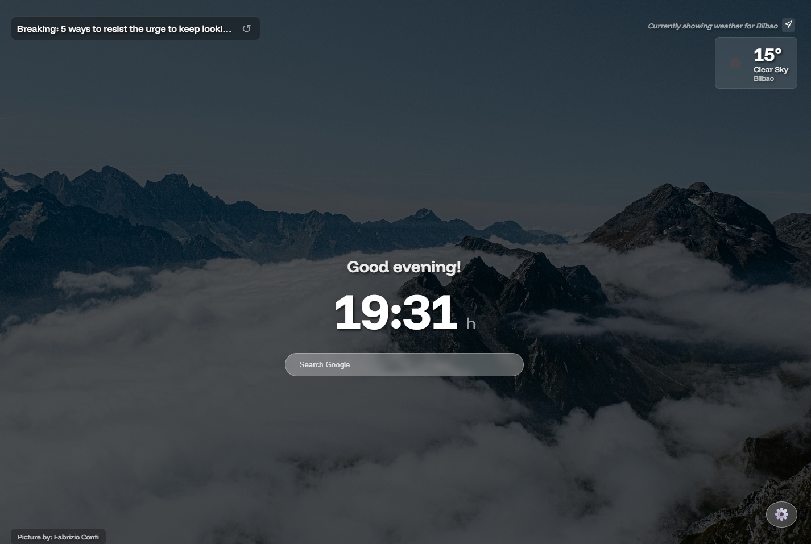
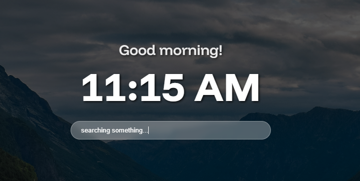
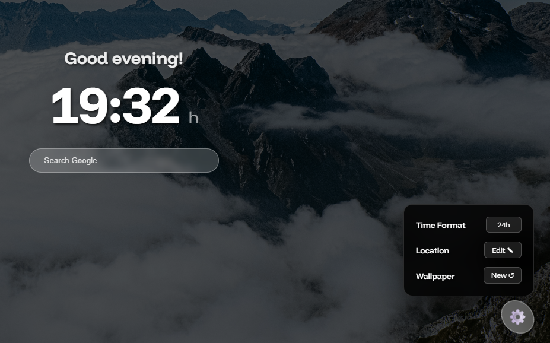

# dashboard-extension

<table>
  <tr>
    <td></td>
    <td></td>
    <td></td>
  </tr>
</table>

Personal Dashboard Chrome Extension

A minimalist, high-performance Chrome Extension that replaces the "New Tab" page with a beautiful, data-driven dashboard. Built with vanilla JavaScript and integrated with multiple third-party APIs.

🚀 New in Version 1.0.5:

- Customizable Settings Menu: A new sleek, glassmorphism-style settings panel to manage your dashboard preferences.

- Time Format Toggle: Switch instantly between 12-hour and 24-hour (Military) time formats. The 24h mode features a technical "h" suffix for a professional dashboard look.

Location Override: Don't want to use GPS? You can now manually enter your city to get weather data for any location in the world.

Persistent Preferences: Your time format and custom location are saved automatically to localStorage, so your dashboard stays exactly how you like it.

✨ Core Features:

- Smart Caching: Optimized performance using localStorage to cache News, Weather, and Background data. This reduces API calls and ensures instant loading.

- Intelligent Geolocation: Automatically detects your local weather, with a built-in London fallback if location permissions are denied.

- Dynamic Greetings: Context-aware greetings (Good Morning/Afternoon/Evening) that change based on your local time.

- Local Weather Assets: Weather icons are served locally from the extension package, ensuring offline availability and lightning-fast UI rendering.

🕹️ Interactive Controls:

- Settings Toggle: Click the ⚙️ icon in the bottom right to customize your experience.

- Manual Weather: Use the "Edit Location" button in the settings menu to search for weather in a specific city.

- Shuffle News: Click the headline to cycle through cached articles instantly.

- Smart Navigation: Use Ctrl + Click (Windows) or Cmd + Click (Mac) to open full articles in a new tab.

- Force Refresh: Dedicated refresh icons for both News and Backgrounds to bypass cache and fetch fresh data.

- Integrated Search: A centered, glassmorphism-styled Google search bar with auto-focus for immediate utility.

🛠️ Tech Stack:

- HTML5 & CSS3 (Flexbox, CSS Variables, Glassmorphism)

- Vanilla JavaScript (ES6+, Fetch API, Async/Await)

- Manifest V3 Compliant: Built using the latest Chrome extension standards for improved security and performance.

- Asset Accessibility: Configured web_accessible_resources to securely handle local images and sub-directory assets.

🔑 Required APIs:

To run this project, you will need to obtain free API keys from:

OpenWeatherMap API: For current weather data.

NewsAPI: For breaking news headlines.

Unsplash API: (Optional) The project uses a Scrimba proxy by default, but you can integrate your own Unsplash ID for higher rate limits.

⚙️ Setup & Installation:

1. Clone the repository:

Bash

git clone https://github.com/Anuska86/dashboard-extension.git

2. Create a config.js file in the root directory (this file is ignored by Git for security).

3. Add your API keys to config.js:

JavaScript

const config = {
NEWS_API_KEY: "your_news_api_key_here",
WEATHER_API_KEY: "your_weather_api_key_here"
};

4. Open Chrome and navigate to chrome://extensions/.

5. Enable Developer Mode in the top-right corner.

6. Click Load Unpacked and select the project folder.

⚠️ Security Note: The config.js file is included in .gitignore to prevent your private API keys from being leaked to GitHub. Never commit your actual keys to a public repository.

🎨 Customization

Changing News Topics

By default, the dashboard fetches news related to technology, science, and business. You can easily customize this by modifying the `newsUrl` variable in `index.js`:

JavaScript

// Change the words after 'q=' to your preferred topics
const newsUrl = `https://newsapi.org/v2/everything?q=coding+OR+space+OR+design&...`

Changing Background Themes
To change the type of images fetched from Unsplash, update the query parameters in the background fetch call within index.js:

// Change 'nature,mountains' to 'architecture', 'travel', etc.
fetch("[https://apis.scrimba.com/unsplash/photos/random?orientation=landscape&query=nature,mountains](https://apis.scrimba.com/unsplash/photos/random?orientation=landscape&query=nature,mountains)")

Customizing Weather Icons:

The extension uses a curated set of icons located in images/weather_icons/. These match the OpenWeatherMap icon codes. To use your own icons, simply replace the .png files in that folder while keeping the original filenames (e.g., 01d.png).

Customizing the Fallback Background:

To change the default image that appears while the dashboard is loading, replace images/background.jpg with your own high-resolution image. To update the credit for your local image, modify the setInitialFallback() function in index.js.

Managing Cache Settings

The extension is set to refresh News/Weather every 30 minutes and Backgrounds every 2 hours to stay within API free-tier limits. You can adjust the expiry variables in index.js to change these intervals:

JavaScript

const expiry = 30 _ 60 _ 1000; // Change '30' to your preferred minutes

Search Bar Target By default, the search opens in a new tab (target="\_blank") to keep your dashboard open. To change this to the same tab, remove the target attribute from the <form> tag in index.html.

📄 License:

This project is licensed under the MIT License. See the LICENSE file for details.

👩‍💻 Author:

